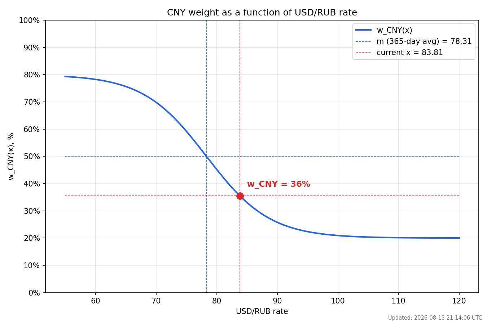
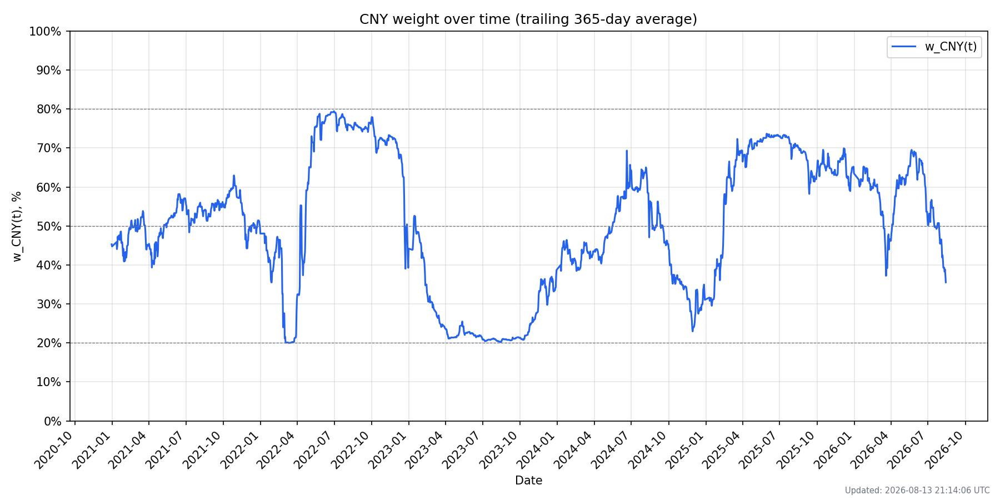

# USD/RUB Weight Report

**Date:** 2026-08-14
**Updated:** 2026-08-13 21:14:06 UTC

- Current USD/RUB rate (x): **83.8058**
- 365-day average USD/RUB rate (m): **78.3135**
- w_CNY(x): **36%**
- w_RUB(x): **64%**

