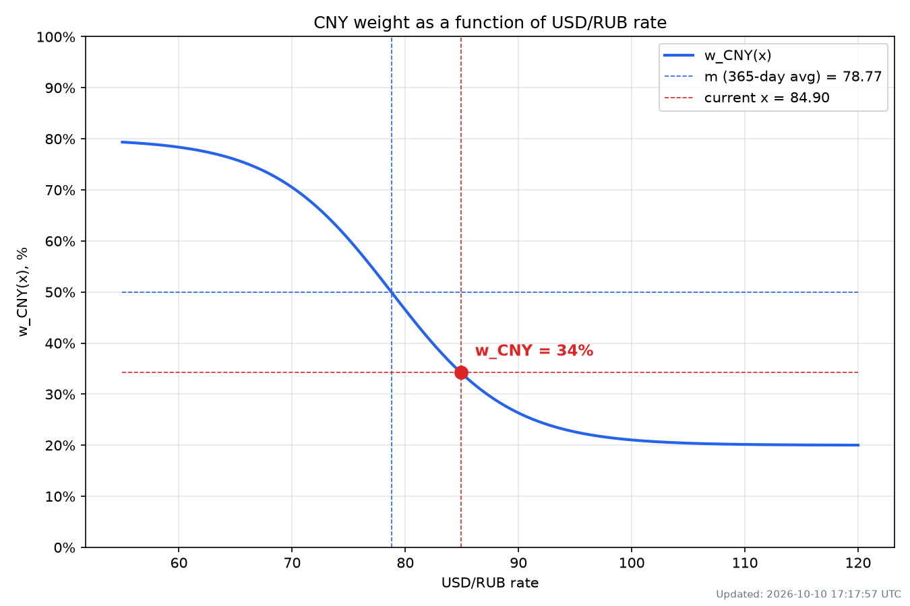
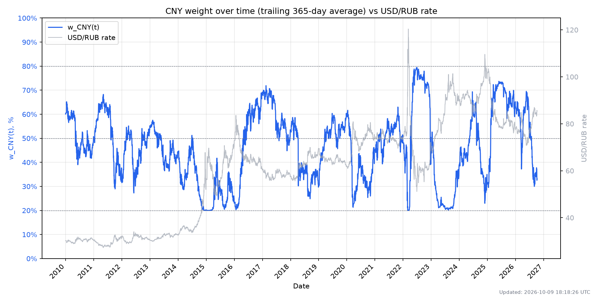

# USD/RUB Weight Report

**Date:** 2026-10-08
**Updated:** 2026-10-08 18:47:51 UTC

- Current USD/RUB rate (x): **85.4173**
- 365-day average USD/RUB rate (m): **78.7487**
- w_CNY(x): **33%**
- w_RUB(x): **67%**

