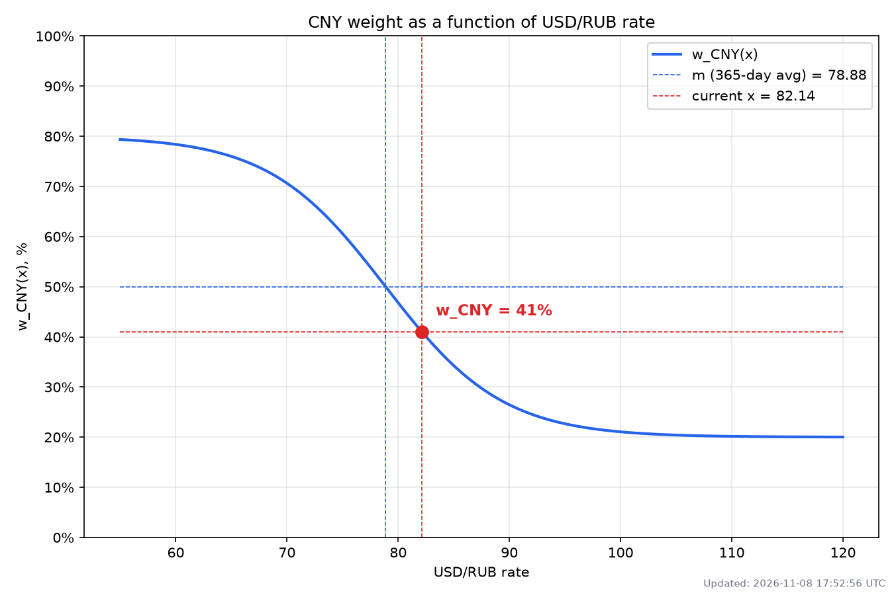
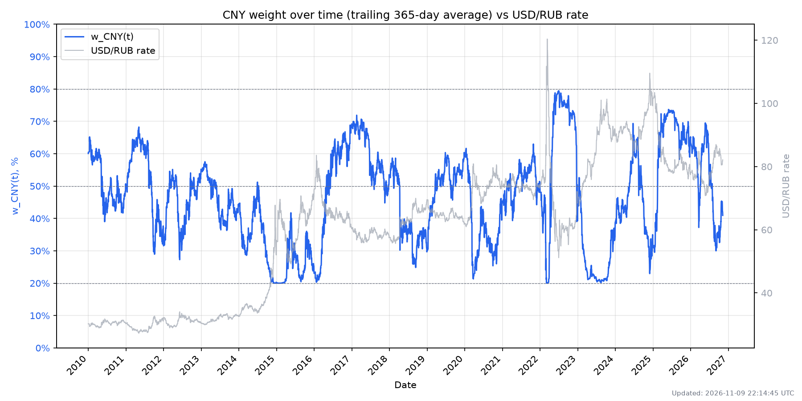

# USD/RUB Weight Report

**Date:** 2026-11-07
**Updated:** 2026-11-07 17:42:37 UTC

- Current USD/RUB rate (x): **82.1386**
- 365-day average USD/RUB rate (m): **78.8750**
- w_CNY(x): **41%**
- w_RUB(x): **59%**

